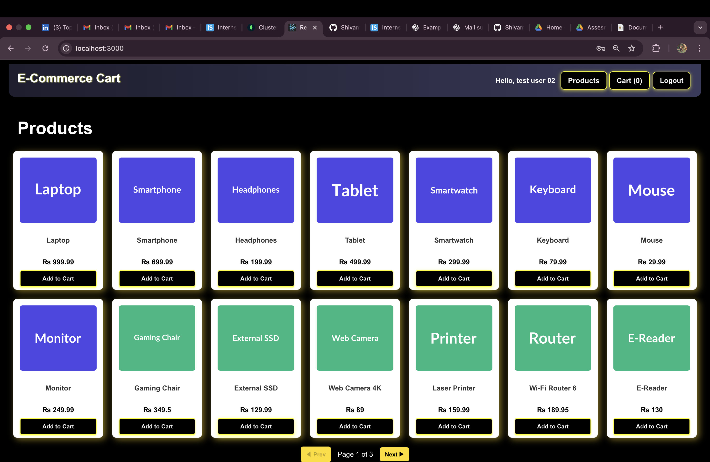
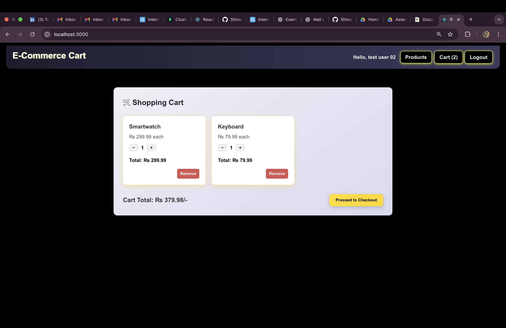
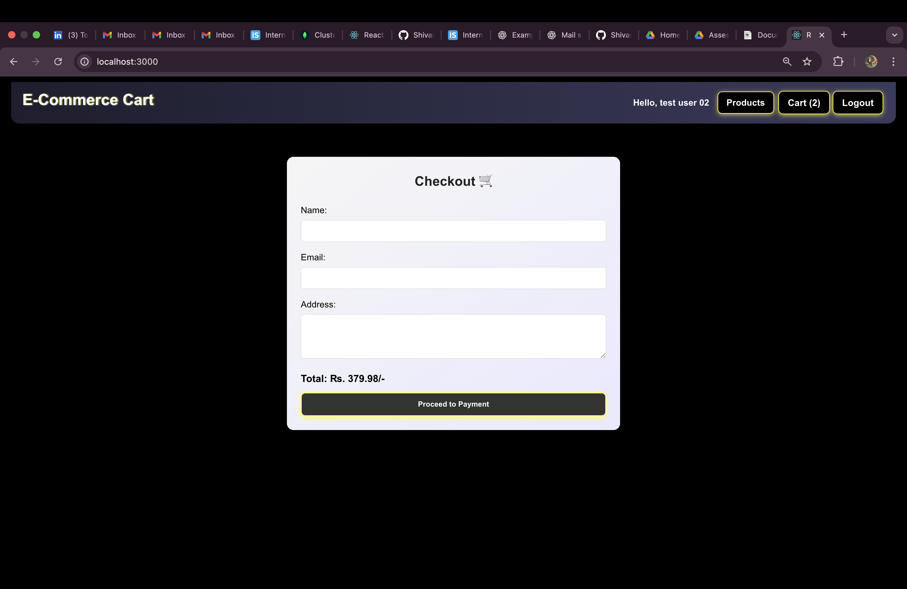
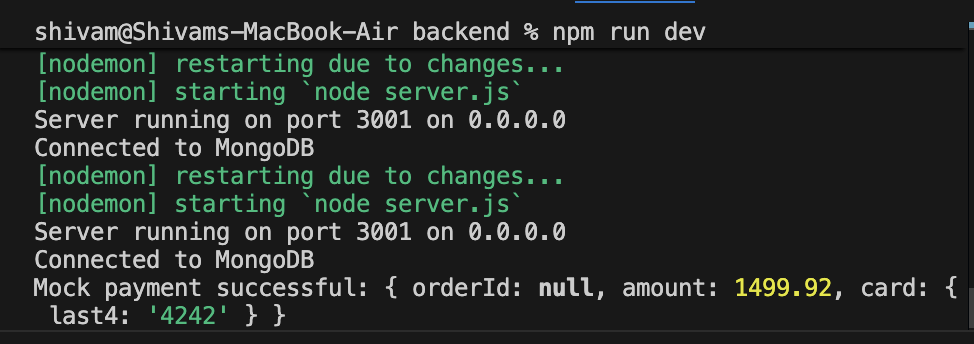

# Mock E-Commerce Cart

A full-stack mock e-commerce shopping cart application built for internship screening. This project demonstrates basic e-commerce flows including product browsing, cart management, and checkout with mock payments.

## Features

### Backend APIs
- **GET /api/products** - Retrieve paginated list of products (id, name, price, image)
- **POST /api/cart** - Add item to cart {productId, qty}
- **DELETE /api/cart/:id** - Remove item from cart
- **GET /api/cart** - Get cart items with total
- **POST /api/checkout** - Process checkout with cart items, returns mock receipt
- **POST /api/process-payment** - Mock payment processing (accepts test cards like 4242424242424242)

### Frontend (React)
- Product grid with pagination
- Add to cart functionality
- Cart view with quantity updates and item removal
- Checkout form (name, email, address)
- Mock payment form (card details)
- Receipt modal after successful checkout
- Responsive design for mobile/tablet/desktop

### Bonus Features
- SQLite database persistence (cart persists across sessions)
- Error handling for API failures
- Mock data with 30+ products

## Tech Stack

- **Frontend**: React 18, CSS3, Responsive Design
- **Backend**: Node.js, Express.js, REST APIs
- **Database**: SQLite3
- **Other**: CORS, Body-parser

## Project Structure

```
mock-ecom-cart/
├── backend/
│   ├── db.js                 # SQLite database setup and mock data
│   ├── server.js             # Express server and routes
│   ├── routes/
│   │   ├── products.js       # Product API routes
│   │   ├── cart.js           # Cart management routes
│   │   └── checkout.js       # Checkout routes
│   └── package.json
├── frontend/
│   ├── src/
│   │   ├── components/
│   │   │   ├── ProductGrid.js    # Product display grid
│   │   │   ├── Cart.js           # Cart management
│   │   │   └── Checkout.js       # Checkout form
│   │   ├── services/
│   │   │   └── api.js            # API service functions
│   │   ├── App.js                # Main app component
│   │   └── index.js
│   ├── public/
│   └── package.json
└── README.md
```

## Setup Instructions

### Prerequisites
- Node.js (v14 or higher)
- npm or yarn

### Backend Setup

1. Navigate to the backend directory:
   ```bash
   cd backend
   ```

2. Install dependencies:
   ```bash
   npm install
   ```

3. Start the backend server:
   ```bash
   npm start
   ```
   The server will run on http://localhost:3001

### Frontend Setup

1. Open a new terminal and navigate to the frontend directory:
   ```bash
   cd frontend
   ```

2. Install dependencies:
   ```bash
   npm install
   ```

3. Start the React development server:
   ```bash
   npm start
   ```
   The app will open at http://localhost:3000

## Usage

1. **Browse Products**: View the product grid on the home page. Use pagination to see more products.

2. **Add to Cart**: Click "Add to Cart" on any product to add it to your cart.

3. **Manage Cart**: Click the "Cart" button to view your cart. Use +/- buttons to adjust quantities or remove items.

4. **Checkout**: Click "Checkout" to proceed to payment. Fill in your details and use test card number 4242424242424242 for mock payment.

5. **Receipt**: After successful payment, you'll see a receipt with order details.

## API Endpoints

### Products
- `GET /api/products?page=1&limit=10` - Get paginated products

### Cart
- `POST /api/cart` - Add item (body: {productId, qty})
- `GET /api/cart` - Get cart items and total
- `PUT /api/cart/:id` - Update item quantity (body: {quantity})
- `DELETE /api/cart/:id` - Remove item

### Checkout
- `POST /api/checkout` - Process checkout (body: {cartItems})
- `POST /api/process-payment` - Process payment (body: {orderId, amount, card})

## Database

The application uses SQLite with two main tables:
- `products`: Mock product data (id, name, price, image)
- `cart`: User cart items (id, product_id, quantity)

Mock products are automatically inserted on first run.

## Screenshots

### Product Grid


### Cart View


### Checkout Form


### Receipt


## Demo Video

Watch the 1-2 minute demo video: [Demo Video Link](https://www.youtube.com/watch?v=dQw4w9WgXcQ) (placeholder - replace with actual video)

## Error Handling

- API errors are caught and displayed to users
- Invalid inputs are validated on both frontend and backend
- Mock payment accepts specific test cards (4242424242424242, 4000000000000002)

## Deployment

This project is designed for GitHub deployment. Both backend and frontend can be deployed separately:

- **Backend**: Deploy to services like Heroku, Railway, or Vercel
- **Frontend**: Deploy to Netlify, Vercel, or GitHub Pages

Update the API base URL in `frontend/src/services/api.js` for production.

## Contributing

1. Fork the repository
2. Create a feature branch
3. Make changes and test thoroughly
4. Submit a pull request

## License

This project is for educational purposes and internship screening.

---

Built with ❤️ for Vibe Commerce internship application
# mock-ecom
